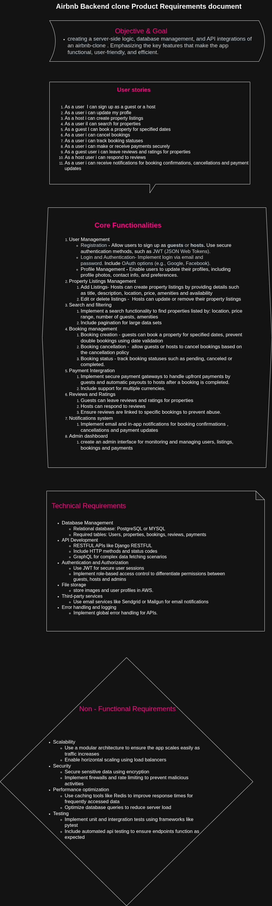

# alx-airbnb-project-documentation
### Airbnb Clone Backend

A backend system for a hotel and property booking platform, inspired by Airbnb. This repository contains the backend architecture, API design, and product planning documentation, starting with the Product Requirements Document (PRD).

### Purpose

The goal of this project is to design and build a robust backend for a property rental platform that enables users to:
- Discover properties
- Make and manage bookings
- Communicate with hosts
- Review stays
- Handle secure payments

The purpose of this backend is to **provide a seamless, secure, and scalable booking experience** for both guests and hosts.